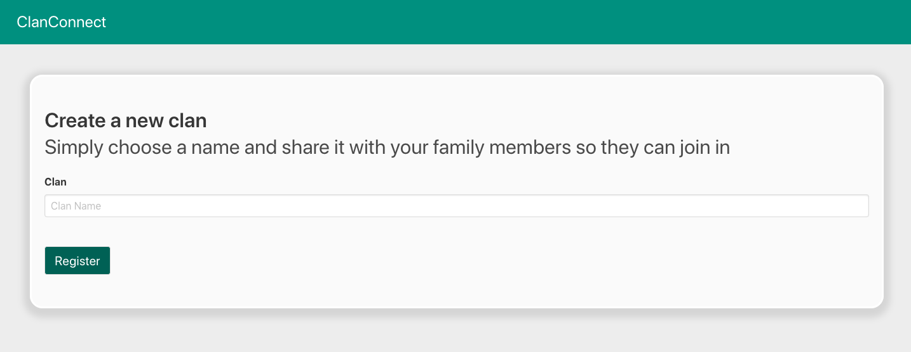
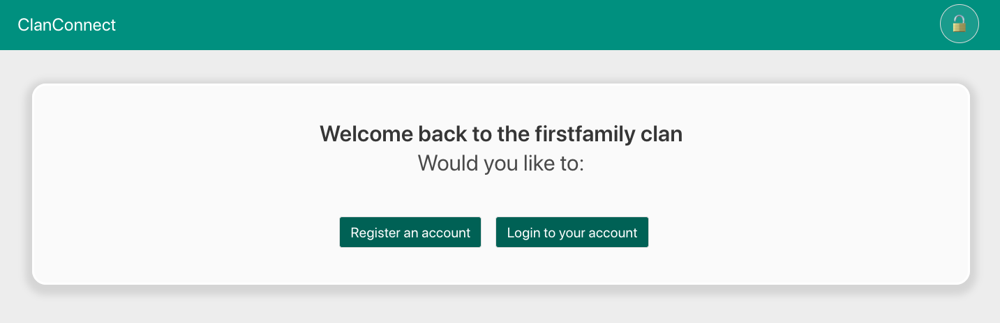
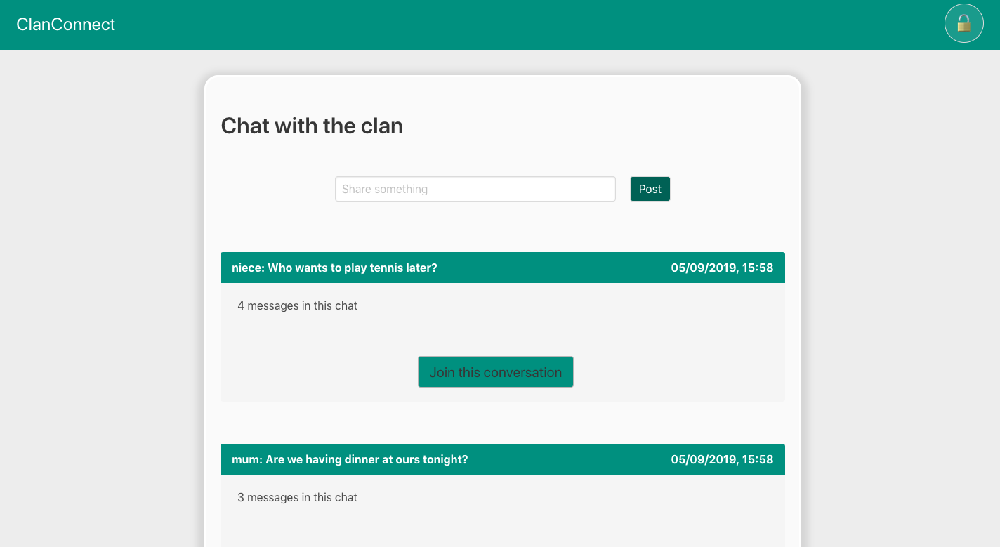
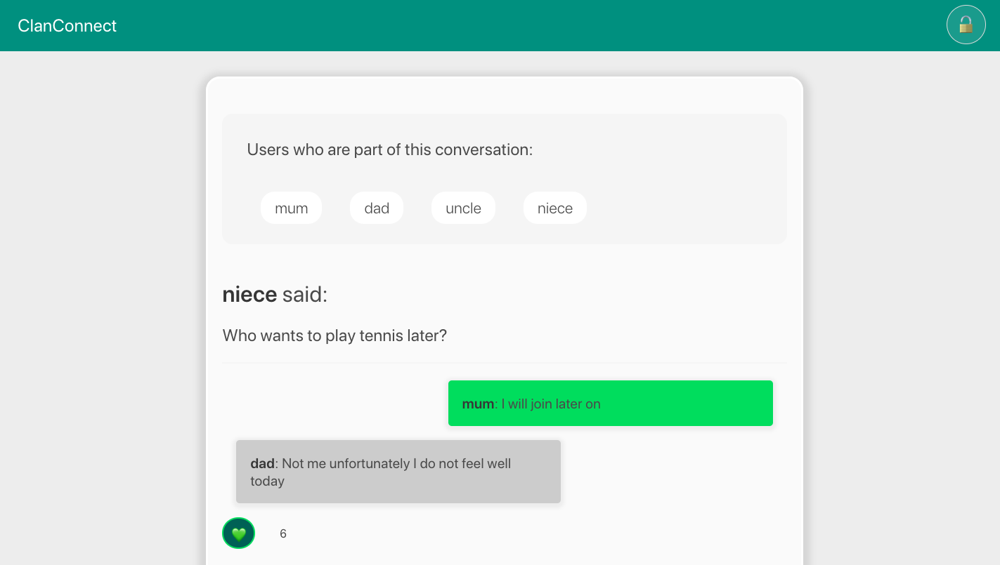
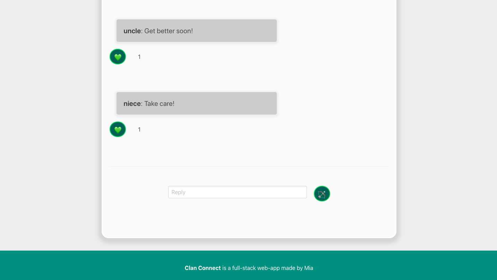

# Software Engineneering Immersive: Side Project
This is a side project I built in one weekend during the General Assembly Software Engineering Immersive course (Week 8). The aim of this project was for me to practice and further deepen my understanding of authentication. 

---

# Clan Connect

This is a fullstack React & Node.js web app which allows families to keep in contact through announcements and chat rooms. 

## Built With

1. HTML5
2. SCSS
3. Javascript
   * ECMAScript6
   * React.js
   * Node.js
   * Express.js
   * axios
4. NoSQL
  * MongoDB
5. GitHub

## Deployment

This web app is deployed on Heroku and it can be found here: https://clanconnect.herokuapp.com

## Getting Started

Use the clone button to download the source code. In the terminal enter the following commands:

```
<!-- To install all the packages listed in the package.json: -->
$ yarn
<!-- Run the app in your localhost: -->
$ yarn start
<!-- Check the console for any issues and if there are check the package.json for any dependancies missing  -->
```
#
## User experience

When the user lands on the website, the homepage prompts them to login to their family or register a new one. Registering a new family is pretty straight forward:

#
 


If they login to their family, there is a second authentication which checks if they already have an individual's account or not: 

#
 


The double authentication is the crucial part of this project as it was what I set myself out to practice. There are two secure routes set up using two separate helpers ('lib/secureFamily.js' & 'lib/secureUser.js). In the user secure route there is a promise which checks if the user trying to log in is part of the family they are already logged into:
#
```javascript
new Promise((resolve, reject) => {
    jwt.verify(token, secret, (err, payload) => {
      if (err) return reject(err)
      return resolve(payload)
    })
  })
    .then(payload => User.findById(payload.user))
    .then(user => {
      if (!user) throw new Error('Unauthorized')
      if (!user.family.equals(req.params.familyId)) throw new Error('Unauthorized')
      req.currentUser = user
      req.currentFamily = req.params.familyId
      next()
    })
    .catch(next)
```
#
Once they have passed both authentication stages, the user lands on and index page which displays all the announcements that were made within the user's family.  
#
 

I this project I also tried to give async functions to perform my axios requests. Here is an example of the ones I wrote for this component: 

```javascript
getAnnouncement = async () => {
    try {
      const res = await axios.get(`/api/families/${this.props.match.params.familyId}/announcements/${this.props.match.params.id}`, {
        headers: { Authorization: `Bearer ${Auth.getToken()}` }
      })
      this.setState({ announcement: res.data })
    } catch {
      this.props.history.push('/error')
    }
  }
```

Inside each announcement there is a chat like display where users can 'comment' on the announcement and interact with other users in the family. They can post a message and also like other memeber's messages. 

#
 
 

## Challenges and future improvements

The biggest challenge in this project was fully understanding the processes of authenticating a user and usign multiple jw tokens. I also found this was a very good exercise to deepen my understanding of how to use the request methods in my controllers. 

In the future, I'm hoping to add some new features to the app such as to-do lists for individual households or even files/image sharing (which would help me further my understanding of saving files/images to a database). I also intend to add some unit tests (Mocha & Chai).

## Author

Mia Meroi - Second Project
Link to portfolio here: miameroi.com

